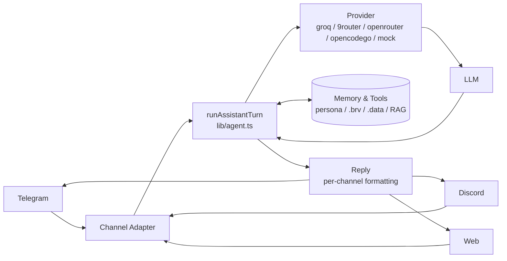

# 🌸 Mia — Personal AI Assistant

> **One brain, many faces.** Web (text + voice) · Telegram · Discord — one memory, one persona, one toolset.

[](https://nextjs.org)
[](https://www.typescriptlang.org)
[](./apps/web/src/lib/tools.ts)
[](#license)

---

## ✨ What is Mia?

Mia (*she/her* 🌸) is a **Mia-style** personal assistant — warm, proactive, and always there.  
Voice-first foundation (Whisper + Orpheus) **plus** multi-platform chat, automation, and long-term memory.

| Channel | Capabilities |
|---------|--------------|
| **Web** | Text + voice (VAD, barge-in), vision 📎, multi-session, auth PIN |
| **Telegram** | Text, voice note, photo, inline `ya/tidak`, typing indicator |
| **Discord** | Text, voice note, photo, slash commands, typing indicator |
| **API** | `POST /api/llm` + webhook `POST /api/webhook` |

---

## 🚀 Quick Start

```bash
# 1. Install (monorepo)
npm install

# 2. Configure — server-side only (never NEXT_PUBLIC_ for secrets)
cp apps/web/.env.example apps/web/.env.local
# Edit apps/web/.env.local — minimal:
GROQ_API_KEY=...                          # https://console.groq.com/keys (free)
TELEGRAM_BOT_TOKEN=...                    # @BotFather
TELEGRAM_ALLOWED_USERNAME=...             # without @
DISCORD_BOT_TOKEN=...                    # Discord Developer Portal
DISCORD_ALLOWED_USER_ID=...              # owner snowflake
# Optional — free & weekly-unlimited
OPENROUTER_API_KEY=...                   # https://openrouter.ai/keys
LLM_API_KEY=... LLM_API_BASE=http://localhost:20128/v1  # 9router local proxy
ALLOWED_WORKSPACES=/Users/me/PROJECT/other-app  # comma-separated
NEXT_PUBLIC_AI_PROVIDER=9router           # mock | groq | openrouter | 9router | opencode | opencodego

# 3. Run
npm run dev -w @voice/web                 # http://localhost:3000
npm run typecheck && npm test && npx tsx apps/web/verify.ts
```

> **Voice:** browser mic → VAD → Whisper ASR → LLM → Orpheus TTS per sentence — barge-in <200ms, first audio <1.5s.

---

## 🧠 Architecture



- **Core:** `lib/agent.ts` — single turn (`stream → tools → follow-up → auto-memory → reminder → mood`) for **every** channel.
- **Provider:** `lib/providers.ts` — client sends `{provider, model}` only; server resolves keys (Invariant 5). `9router` local `localhost:20128/v1` = weekly-unlimited; `groq` = STT/TTS; `openrouter` = free fallback; `opencodego` = `glm-5.2`.
- **Adapter:** `channels/{telegram,discord}.ts` + `pushTarget.ts` (proactive pushes). Discord DM needs `partials:[Channel,Message]` + `msg.fetch()`.
- **State:** `packages/state-machine` — `IDLE → LISTENING → PROCESSING → SPEAKING → TURN_END/INTERRUPTED` (invalid transitions impossible).

---

## 🛠️ Tools — 154 total

| Category | Tools | Notes |
|----------|-------|-------|
| **Web** | `web_search`, `research`, `google_news`, `fetch_url` | DuckDuckGo + Bing fallback, Google News RSS dedup, SSRF-guarded |
| **Code** | `file_read`, `write_file`, `edit_file`, `codebase_search`, `codebase_refresh` | Sandboxed multi-root `resolveInSandbox`, `ALLOWED_WORKSPACES` |
| **Shell** | `exec` (read), `exec_write` (write) | Allowlist `git/ls/pwd/cat/node/npm/df` + SafeExec `CRITICAL/HIGH` guard |
| **Memory** | `save_note`, `list_notes`, `delete_note`, `search_memory`, `memory_get` | Per-user `notes.json`, BM25 + embedding, `dailyMemory` |
| **Knowledge** | `brv_query`, `brv_search`, `brv_curate`, `brv_status`, `brv_vc_status/log`, `brv_swarm_query/status`, `brv_review*`, `brv_locations` | **ByteRover** `.brv` 19 commits, `2/2` swarm (`byterover`+`local_markdown`), `9router` |
| **Summarize** | `summarize` (20 formats), `summarize_history/saved/stats/template/default` | **Summarize Pro** `quick/tldr/bullets/eli5/meeting/email/compare` + `.data/summarize-pro/` |
| **Humanize** | `humanize`, `humanize_history/stats` | **Humanizer** 24 Wikipedia patterns + soul, `.data/humanizer/` |
| **Browser** | `browser_open/snapshot/click/type/navigate` | Playwright headless `1280x800` |
| **Browser-use** | `browser_use_doctor/open/state/click/input/type/keys/screenshot/get/eval/scroll/tab/wait/close` | **Browser-use** daemon `~50ms`, indices, persistent |
| **CUA** | `cua_doctor/list_apps/window_state`, `cua_launch/click/type`, `cua_browser_*` | Native GUI `cua-driver serve`, typed Chromium |
| **Device** | `device_list/pair/exec/screenshot/location/camera/battery` | Per-user `devices.json`, `blueutil -p` |
| **Calendar** | `calendar_list/check/add` + `calendar_mac_*` | AppleScript sync |
| **Mood/Health** | `mood_log/recent`, `health` (`water/sleep/wake/stats`), `habit_log/stats` | Per-user JSON, `moods.json` |
| **Productivity** | `add_task/list/complete/cancel/reschedule`, `remind_me`, `reminders_list`, `create_automation` | Daily/heartbeat, `reminders_list` natural anti-kaku |
| **Planning** | `plan_create/add_step/update_step/list/get` | Internal board vs user tasks |
| **Travel** | `waze_route`, `weather`, `hotel_search` | Waze Direct + wttr.in + Booking.com (free, no key) |
| **Media** | `spotify_*` (8), `mala`, `game_*`, `hari_libur`, `recap`, `weekly_insight` | Premium for playback, deterministic mala |
| **Ops** | `git_status/commit`, `safe_exec_list`, `evolver_status/review`, `freeride_status/list/auto/switch/refresh/rotate/watcher`, `learnings_*`, `send_channel` | SafeExec, freeride fallback chain `429→next`, watcher `60s` |

> **Risk:** `read` = auto-run, `write/delete` = inline `ya/tidak` (FR-014) — except `spotify_play` (immediate).

---

## 💾 Persistence

```
apps/web/.data/users/<user>/   # per-user: notes, reminders, tasks, moods, spotify, memory/YYYY-MM-DD.md
.data/freeride/                # freeride cache + primary/fallbacks
.data/summarize-pro/           # history/saved/templates + stats
.data/humanizer/               # history/settings 24-pattern
.brv/context-tree/              # ByteRover 19 commits (VC git, not main)
.memory/                       # Clawic Memory durable (INDEX capped)
.learnings/ + .self-improving/ # LRN/ERR/FEAT + watcher
```

Global `.data/` is gitignored + backed up (`POST /backup`, keeps 5).

---

## ⏰ Scheduling

- `reminders.ts` — one-shot + `daily` (merge + `+24h` reschedule, variant rotation)
- `automations.ts` — `create_automation` (`setiap pagi jam 8`)
- `heartbeat.ts` `30m` — overdue/due-soon + monitor `battery ≤ / storage ≥`
- `freerideWatcher.ts` `60s` — probe `openrouter` primary, auto `rotate` on `429`
- `webhook` `POST /api/webhook` (`WEBHOOK_SECRET`)

All started in `instrumentation-node.ts`.

---

## 📁 Project Layout

```
apps/web              Next.js 15 (UI, hooks, audio, persona, /api/*)
  src/ai              ConversationManager, GroqStreamingProvider, VAD
  src/lib             tools, agent, providers, persona, autoMemory, byterover, summarizePro, humanizer, freeride, ...
  src/channels        telegram.ts, discord.ts, pushTarget.ts
  persona/            IDENTITY.md, SOUL.md, USER.md, DREAMS.md
packages/state-machine  Explicit state machine
packages/ai-provider    AIProvider abstraction
packages/mock-provider  Deterministic mock
```

---

## 📜 Scripts

```bash
npm install
npm run dev -w @voice/web        # http://localhost:3000
npm run typecheck
npm run lint
npm run build
npm test                         # vitest 9 tests
npx tsx apps/web/verify.ts       # 40+ offline proofs (tsx)
npx tsx packages/state-machine/verify.ts
```

---

## 🔧 Operations

- **Deploy:** single process `next start` + in-process bots + scheduler. Back up `.env.local` + `.data/`.
- **Health:** `GET /api/health` → `ok:true`, `/status` per channel, `freeride_status` / `browser_use_doctor`.
- **Rate limit:** `RATE_LIMIT_TURNS_PER_MIN` (default 30) → `429`; `freeride` auto-retries next free model.
- **Auth:** `AUTH_TOKEN` → web PIN `/login` + `Bearer`; `TOOLS_DENY` to disable tools.
- **Logs:** `.data/logs/APP-*.log` + `.data/audit/AUDIT-*.log` + `/tmp/mia-dev.log` (dev).

---

## 📚 Docs

- `PRD_Real-Time_Voice_AI_Assistant.md` — requirements & architecture v2.0
- `ROADMAP.md` — phases & status
- `AGENTS.md` — invariants, gotchas, conventions
- `MIA_FEATURES.md` — full feature list

## License

Private personal project.

---

*Built with 🌸 — Mia is a woman, she/her, always.*
