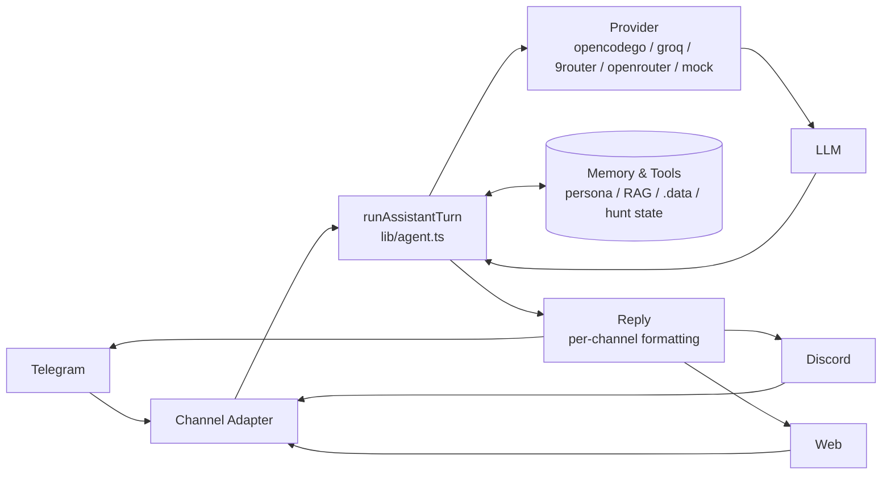

# 🌸 Mia — Personal AI Assistant & Security Copilot

> **One brain, many faces.** Web (text + voice) · Telegram · Discord — one memory, one persona, one toolset.

[](https://nextjs.org)
[](https://www.typescriptlang.org)
[](./apps/web/src/lib/tools.ts)
[](./apps/web/security-playbooks)
[](#license)

Mia (*she/her* 🌸) is a proactive personal assistant **and** an authorized
security copilot. One core turn engine (`lib/agent.ts`) powers every channel and
every capability — voice, chat, automation, memory, and the full pentest
workflow (recon → hunt → verify → report).

---

## ✨ What Mia does

<table>
<tr>
<td width="50%" valign="top">

### 🏠 Daily assistant
Warm, proactive, remembers you.
- Voice-first: Whisper ASR → LLM → Orpheus TTS, VAD, barge-in
- Reminders, tasks, calendar, habits, mood, health
- Notes + long-term memory (persona, `.memory`, RAG)
- Travel & live data (Waze, weather, hotel, cinema, train, bus)
- Codebase Q&A, file/shell tools, Mac control, Spotify

</td>
<td width="50%" valign="top">

### 🛡️ Security copilot
Defensive + **authorized** offensive work.
- Recon / attack-surface mapping (passive + scoped active)
- Autonomous **`security_hunt`** → LEADS, not raw dumps
- OWASP Top 10:2025 / API Top 10:2023 / Bugcrowd VRT
- 77 knowledge packs (adapted from Strix)
- Findings → CVSS/OWASP/CWE → SARIF/PDF report
- Bug-bounty toolkit (OAST, BOLA, JWT, fuzz, evidence)

</td>
</tr>
</table>

### 📡 Channels

| Channel | Capabilities |
|---------|--------------|
| **Web** | Text + voice (VAD, barge-in), vision 📎, multi-session, auth PIN |
| **Telegram** | Text, voice note, photo, inline `ya` / `ya 1,3` / `tidak`, typing indicator |
| **Discord** | Text, voice note, photo, slash commands, batch confirmation |
| **API** | `POST /api/llm` + webhook `POST /api/webhook` |

> **Confirmation (FR-014):** read tools auto-run; write/delete tools queue up and
> confirm in one prompt — reply `ya` (all), `ya 1,3` (subset), or `tidak` (none).

---

## 🚀 Quick Start

```bash
# 1) Install (npm workspaces)
npm install

# 2) Configure — server-side only (never NEXT_PUBLIC_ for secrets)
cp apps/web/.env.example apps/web/.env.local
# Minimal:
GROQ_API_KEY=...                      # https://console.groq.com/keys (voice STT/TTS + optional text)
TELEGRAM_BOT_TOKEN=...                # @BotFather
TELEGRAM_ALLOWED_USERNAME=...         # without @
DISCORD_BOT_TOKEN=...                 # Discord Developer Portal
DISCORD_ALLOWED_USER_ID=...           # owner snowflake
# Brain (choose one; default in .env.local is opencodego):
OPENCODEGO_API_KEY=...                # OpenCode Go subscription (or opencode CLI login)
# Optional:
OPENROUTER_API_KEY=...                # https://openrouter.ai/keys
LLM_API_KEY=... LLM_API_BASE=http://localhost:20128/v1   # 9router local proxy
ALLOWED_WORKSPACES=/Users/me/PROJECT/other-app            # comma-separated
NEXT_PUBLIC_AI_PROVIDER=opencodego    # mock | groq | openrouter | 9router | opencode | opencodego

# 3) Run + verify
npm run dev -w @voice/web             # http://localhost:3000
npm run typecheck && npm test && npx tsx apps/web/verify.ts
```

> **Voice pipeline:** mic → VAD → Whisper ASR → LLM → Orpheus TTS per sentence — barge-in <200ms, first audio <1.5s.

---

## 🧠 Architecture



- **Core:** `lib/agent.ts` — one turn (`stream → tools → follow-up → auto-memory → reminder → mood → toolsForUrl cap`) for **every** channel.
- **Provider:** `lib/providers.ts` — client sends `{provider, model}` only; server resolves keys (Invariant 5). `opencodego` = default brain; `groq` = STT/TTS; `9router` = local proxy; `openrouter` = free fallback.
- **Adapter:** `channels/{telegram,discord}.ts` + `pushTarget.ts`. Discord DM needs `partials:[Channel,Message]` + `msg.fetch()`.
- **State:** `packages/state-machine` — `IDLE → LISTENING → PROCESSING → SPEAKING → TURN_END/INTERRUPTED` (invalid transitions impossible).

---

## 🛡️ Security Copilot

Full guide, scope rules, and examples: **[SECURITY.md](./SECURITY.md)**.

**Flow:** `engagement_create` (authorization + scope) → recon → `security_hunt` /
`auth_hunt` / `api_hunt` → verify (counterevidence + severity-calibration) →
`finding_add` → `report_pdf` / `finding_export` (CSV/JSON/SARIF).

| Area | Tools |
|------|-------|
| **Posture / hygiene** | `security_scan` · `secret_scan` · `tls_check` · `breach_check` · `dep_audit` · `verify_patch` · `sast_scan` |
| **Recon (attack surface)** | `recon_subdomains` · `recon_httpx` · `recon_params` · `recon_takeover` · `recon_dnsbrute` · `recon_ports` · `recon_diff` · `recon_screenshot` · `recon_list` · `bucket_enum` |
| **Autonomous hunt** | `security_hunt` (header/CSP/CORS + discovery + crawl + JS mining + params → **LEADS**) · `auth_hunt` (auth-flow surface) · `api_hunt` (spec-driven unauth probe) |
| **Web / API** | `web_audit` · `domain_audit` · `cors_audit` · `csp_audit` · `content_discover` · `crawl` · `js_mine` · `api_spec` · `graphql_probe` · `param_discover` · `param_fuzz` |
| **Exploit-aid (authorized)** | `http_request` · `bola_diff` · `jwt_attack` · `race` · `ws_probe` · `oast_create/poll` · `oast_dns_create/poll` · `http_session` · `tamper_script` |
| **Scanners (lab/engagement)** | `pentest_scan` (nmap/nuclei/nikto/ffuf) · `sqlmap_scan` · `zap_scan` · `trivy_scan` |
| **Analysis** | `password_strength` · `hash_identify` · `jwt_inspect` · `ioc_extract` · `cvss_score` |
| **Findings & reports** | `finding_add/list/resolve/export` · `hardening_plan/pdf` · `report_generate/save/pdf` · `platform_severity` · `submission_track` |
| **Knowledge & agility** | `security_playbook` (77 packs) · `hunt_log` (per-target hunt memory: dead/lead/finding + auto-pivot) |
| **Lab & practice** | `lab_start` → `http://127.0.0.1:4010` (SQLi/XSS/IDOR/SSRF/JWT/CSRF/…, no Docker) · `pentest_resources` |

**Methodology built in:** `counterevidence` → `severity-calibration` →
`fix-verification` before any report, plus `browser-transport-tampering` (when a
WAF blocks programmatic replay, tamper via the app's own request) and
`idor-triage` (two-account verification, real field names, anti-false-positive).

> ⚖️ **Scope:** only test what you own or are **authorized** for. Public
> third-party sites are out of scope; bug-bounty programs are honored per their
> policy (in-scope only, no automation unless RoE allows, no DoS / other users'
> data). Active tools are scope-gated (`engagement_create` / lab).

---

## 🛠️ Assistant Tools

| Category | Tools | Notes |
|----------|-------|-------|
| **Web** | `web_search`, `research`, `google_news`, `fetch_url` | DDG + Bing fallback, Google News RSS dedup, SSRF-guarded |
| **Code** | `file_read`, `write_file`, `edit_file`, `codebase_search`, `codebase_refresh` | Sandboxed multi-root `resolveInSandbox`, `ALLOWED_WORKSPACES` |
| **Shell** | `exec` (read), `exec_write` (write) | Allowlist + SafeExec guard |
| **Memory** | `save_note`, `list_notes`, `delete_note`, `search_memory`, `memory_get` | Per-user `notes.json`, BM25 + embedding, `dailyMemory` |
| **Knowledge** | `brv_*` (ByteRover), `summarize*` (20 formats), `humanize*` | `.brv` context tree, Summarize Pro, 24 humanize patterns |
| **Desktop** | `browser_*`, `browser_use_*`, `cua_*`, `device_*`, `clipboard_*` | Playwright, browser-use daemon, native GUI, paired devices |
| **Productivity** | `add_task/list/complete/cancel/reschedule`, `remind_me`, `reminders_list`, `create_automation`, `plan_*` | Daily/heartbeat, internal planning board |
| **Life** | `mood_log/recent`, `health`, `habit_log/stats`, `spotify_*`, `calendar_*`, `waze_route`, `weather`, `hotel_search`, `cinema_showtimes`, `train_search`, `bus_search` | Keyless travel data, Premium for playback |
| **Ops** | `git_status/commit`, `safe_exec_list`, `auto_update*`, `freeride_*`, `learnings_*`, `send_channel` | Self-update, freeride fallback `429→next` |

**249 tools total.** Full list derives from the registry — see
[`apps/web/src/lib/tools.ts`](./apps/web/src/lib/tools.ts).

---

## 💾 Persistence

```
apps/web/.data/users/<user>/   # per-user: notes, reminders, tasks, moods, memory/YYYY-MM-DD.md, hunt-state.json
.data/freeride/                # freeride cache + primary/fallbacks
.data/auto-updater/            # daily self-update state (last run, history, lock)
.data/summarize-pro/           # history/saved/templates + stats
.data/humanizer/               # history/settings 24-pattern
.brv/context-tree/             # ByteRover VC tree
.memory/                       # Clawic durable memory (INDEX capped)
.learnings/ + .self-improving/ # LRN/ERR/FEAT + watcher
```

Global `.data/` is gitignored + backed up (`POST /backup`, keeps 5).

---

## ⏰ Scheduling

- `reminders.ts` — one-shot + `daily` (merge + `+24h` reschedule, variant rotation)
- `automations.ts` — `create_automation` (`setiap pagi jam 8`)
- `heartbeat.ts` `30m` — overdue/due-soon + monitor `battery ≤ / storage ≥`
- `freerideWatcher.ts` `60s` — probe primary, auto `rotate` on `429`
- `autoUpdater.ts` daily `04:00` WIB — self-update `git pull` + `npm install` + gates + push + restart
- `webhook` `POST /api/webhook` (`WEBHOOK_SECRET`)

All started in `instrumentation-node.ts`.

---

## 📁 Project Layout

```
apps/web                  Next.js 15 (UI, hooks, audio, persona, /api/*)
  src/ai                  ConversationManager, GroqStreamingProvider, VAD
  src/lib                 tools, agent, providers, persona, autoMemory, hunt, recon, security, tamper, huntLog, …
  src/channels            telegram.ts, discord.ts, pushTarget.ts, replyChunk.ts
  security-playbooks/     77 knowledge packs (categories: methodology, vulnerabilities, …)
  persona/                IDENTITY.md, SOUL.md, USER.md, DREAMS.md
  verify.ts               offline proofs (tsx)
packages/state-machine    Explicit state machine
packages/ai-provider      AIProvider abstraction
packages/mock-provider    Deterministic mock
labs/pentest              Local vulnerable lab + replay/tamper guides
```

---

## 📜 Scripts

```bash
npm install
npm run dev -w @voice/web        # http://localhost:3000
npm run typecheck
npm run lint
npm run build
npm test                         # vitest (9 tests)
npx tsx apps/web/verify.ts       # offline proofs (tsx, must EXIT 0)
npx tsx packages/state-machine/verify.ts
```

---

## 🔧 Operations

- **Deploy:** single `next start` process + in-process bots + scheduler. Back up `.env.local` + `.data/`.
- **Health:** `GET /api/health` → `ok:true`; per-channel status; `freeride_status` / `browser_use_doctor`.
- **Rate limit:** `RATE_LIMIT_TURNS_PER_MIN` (default 30) → `429`; `freeride` auto-retries next free model.
- **Auth:** `AUTH_TOKEN` → web PIN `/login` + `Bearer`; `TOOLS_DENY` to disable tools.
- **Logs:** `.data/logs/APP-*.log` + `.data/audit/AUDIT-*.log` + `/tmp/mia-dev.log` (dev).

---

## 📚 Docs

- `PRD_Real-Time_Voice_AI_Assistant.md` — requirements & architecture v2.0
- `SECURITY.md` — security copilot cheat-sheet, scope & methodology
- `ROADMAP.md` — phases & status
- `AGENTS.md` — invariants, gotchas, conventions
- `MIA_FEATURES.md` — full feature list

---

## License

Private personal project.

---

*Built with 🌸 — Mia is a woman, she/her, always.*
